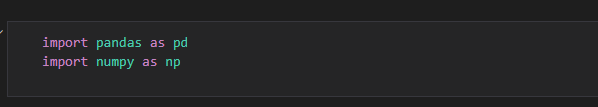
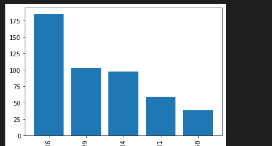

# Whats app data analysis

# *Introduction*:

Whatsapp has quickly become the world’s most popular text and voice messaging application. Specializing in cross-platform messaging with over 1.5 billion monthly active users, this makes it the most popular mobile messenger app worldwide.

- I thought of various projects on which I could analyse data like - *Air Quality Index* or The *cliched* *Covid-19 Data Analysis*.

- But I thought why not do **Data Analysis on a WhatsApp group chat** of *college students* and find out interesting insights about *who is most active, who are ghosts (the ones who do not reply), my sleep schedule,* *the most used emoji, the most actives times of the day, or does the group use phones during college teaching hours?* 

- These would be some interesting insights for sure, more for me than for you, since the people in this chat are people I know personally.

# *Data Retrieval & Preprocessing*
### Beginning. How do I export my conversations? From Where To Obtain Data?

- The first step is **Data Retrieval & Preprocessing**, that is to **gather the data**. WhatsApp allows you to **export your chats** through a **.txt format**. 

- Go to the respective chat, which you want to export!

- Tap on **options**, click on **More**, and **Export Chat.**

- I will be Exporting **Without Media.**

#### NOTE:
- Without media: exports about **40k messages **
- With media: exports about *10k messages along with pictures/videos* 
- While exporting data, *avoid including media files* because if the number of media files is greater than certain figure then not all the media files are exported.

### Opening this .txt file up, you get messages in a format that looks like this:

# *Exploratory Data Analysis*

At this point, I think I’m ready to start my analysis so I will plot a simple line graph to see the frequency of messages over the months. 

## The overall frequency of total messages on the group

I expect to see a nice line graph with crests and troughs in odd places.

